# Stelavox Brief Orchestration Specification
## Version 1.2 — DRAFT 2026-05-23

> This document is the canonical specification for how a Brief flows from
> user approval through to all stages completing. It defines the entities,
> state machines, message bus, actor contracts, and invariants.
>
> **Status:** DRAFT for review. Not yet enforced as Tier-A. The 2026-05-22
> session surfaced repeated state-drift bugs (phantom-redispatch zombies,
> dispatcher/runner contract violation, profile-id-missing INSERTs, prompt
> column dropped by RPC wrapper, stage trigger silent stall). Root cause:
> the orchestration layer had grown across multiple migrations and code
> paths without a written contract, so each write site invented its own
> convention. This spec is the fix-the-spec-not-just-the-code step.
>
> **Audience:** maintainers reviewing the code against the contract.
>
> **Relation to Tier-A docs:** complements `stelavox_director_architecture_v2_0.md`
> (which covers Director agentic loop, tool registry, BYOK, scheduler at
> architectural level) by specifying the entity-by-entity state machine.
> Where this spec disagrees with code, the code is wrong.

---

## 1. Purpose and Scope

**This document defines:**

1. Every entity involved in brief execution (Brief, BriefStage, Workflow,
   WorkflowStep, AgentJob, DirectorTurn, ConversationMessage system events).
2. The legal state values of each entity and the legal transitions between
   them (state diagrams).
3. The message bus — pg_notify channels, system events, scheduled jobs,
   HTTP fallbacks — that drives transitions across actors.
4. Each actor's responsibility: which columns it MAY write, which it MUST
   NOT, and the entry/exit conditions for each transition it performs.
5. The cross-entity invariants that must hold at all times.

**Out of scope:**

- Director LLM behaviour (tool registry, prompts, model selection) — see
  `stelavox_director_architecture_v2_0.md`.
- UI rendering of state (PlanCard, AgentTab, BriefViewer) — see
  `stelavox_component_specification_v2_18.md`.
- BYOK routing and per-user keys.
- Token budget gate and cost accounting.
- Export pipeline.

---

## 2. Design Principles

These principles motivate every state-machine choice and actor contract in
later sections. When a code site appears to violate one, the code is wrong.

**P1. Two-axis state for `agent_jobs`.**
The `status` column tracks business outcome (pending → running → completed →
accepted; or terminal failed / cancelled). The `queue_status` column tracks
queue lifecycle (queued → dispatched → running → terminal). Every transition
writes BOTH columns in the same UPDATE. They MUST agree at terminal.

**P2. One canonical dispatch path per entity type.**
Every workflow_step is dispatched via `advanceWorkflow(workflowId)` → `dispatchAgentJobForStep`. Every director_iteration is dispatched via the
WFQ dispatcher (`runDispatcherTick`). No bypass paths.

**P3. Idempotency on every transition.**
Every RPC and route handler must be safe to call twice. Use
`WHERE status='expected_prior'` or `WHERE status NOT IN terminal_states`
guards. Two concurrent callers must not corrupt state.

**P4. Push-first, pull-fallback.**
The push model (pg_cron → pg_notify → TS listener → dispatcher) is the
primary path. The HTTP fallback at `POST /api/cron/dispatcher-tick` exists
for (a) Vercel production where long-lived LISTEN isn't viable, and
(b) manual recovery when the listener stalls. Both paths are equivalent.

**P5. Completed work cannot be re-dispatched.**
The dispatcher's candidate query and CAS both filter `completed_at IS NULL`.
A row with `completed_at` set is terminal regardless of any other column.

**P6. Lock state has one source of truth.**
`public.check_node_writable(node_id, requesting_user_id)` is the only
authoritative source for whether a node is editable. UI mirrors its output.
API routes call it before every node mutation.

**P7. No dead enum values.**
Every CHECK-constrained value MUST have at least one writer and one reader.
Vestigial values get migration-dropped.

**P8. System events are first-class messages.**
Every meaningful brief/stage/workflow transition emits a system message in
`conversation_messages` (role='system', event_type set). These are the
user-visible audit trail and also feed the Director's context window when
a stage trigger fires.

**P9. Owner-per-column.**
For every state column, exactly one actor class is allowed to write it.
The dispatcher writes `queue_status`. The runner writes `status` (business
outcome). RPCs that mutate both must do so atomically.

**P10. The Brief is the operation contract.**
Once a brief is approved, it runs end-to-end without further user approvals
(subject to `auto_approve_workflow_proposals`). The only required user
touch-points are: (a) explicit Accept on agent_job results for
content-modifying ops; (b) explicit Stop/Cancel.

---

## 3. Entity Catalogue

Seven entities participate in brief orchestration. This section gives
purpose, identity, key relationships, and state column(s). State machines
are in §4.

### 3.1 Brief (`briefs`)

The end-to-end operation plan, scoped to one document. Created when the
user (or Director auto-flow) approves a `propose_brief` artefact.

- **Identity:** `id` UUID. Tied to `document_id` + `organisation_id`.
- **Cardinality:** at most one `status='active'` brief per document
  (partial unique index `briefs_strict_one_active_per_document_uidx`
  restored in M-183).
- **Children:** 1..N `brief_stages` rows.
- **State column:** `status`.
- **Other key columns:**
  - `goal_text` — the user's natural-language goal.
  - `auto_approve_workflow_proposals` — boolean. When true, push-model
    Director-emitted workflows auto-approve and dispatch.
  - `current_stage_id` — pointer to the active stage; advances on stage
    completion; cleared when brief terminal.
  - `cause` — how the brief was initiated. Currently only `'user_initial'`
    is exercised; `'sequence_promotion'` is dead post-M-128.
  - `approved_at` / `started_at` / `completed_at` / `cancelled_at`.

### 3.2 BriefStage (`brief_stages`)

A unit of work within a brief. A stage is **either** workflow-bound (steps
known at proposal time) **or** prompt-deferred (Director plans when its
trigger fires). XOR enforced at the schema layer (M-183, then dropped
M-188; now enforced in Zod at `lib/director/schemas.ts` and
`lib/brief/proposalBuilder.ts`).

- **Identity:** `id` UUID. Belongs to one `brief_id`. Ordered by `order`.
- **State column:** `status`.
- **Trigger:** `trigger_type` ∈ `('after_stage','manual')`. `trigger_config`
  JSONB (e.g. `{"after_stage_order": 1}`).
- **Planning source:**
  - `workflow_id` — FK to `workflows`. Set at proposal time for
    workflow-bound stages OR set by iteration-runner on `propose_workflow`
    for prompt-deferred stages.
  - `prompt` — TEXT. Set for prompt-deferred stages. The push-model
    evaluator includes this in the Director's user-message when invoking.

### 3.3 Workflow (`workflows`)

A coordinated batch of agent operations. Belongs to one document and
(optionally — for ad-hoc Director workflows) one brief_stage.

- **Identity:** `id` UUID.
- **Children:** 1..30 `workflow_steps` rows (cap per Director config).
- **State column:** `status`.
- **Other key columns:**
  - `title` / `description` / `impact_summary` / `estimated_total_minutes`
    — UI display.
  - `approved_at` / `completed_at`.

### 3.4 WorkflowStep (`workflow_steps`)

A single agent operation against a target node. Has dependencies on other
steps in the same workflow (declared via `depends_on_step_orders` or
auto-derived for cascade-serial synthesise).

- **Identity:** `id` UUID. Belongs to one `workflow_id`. Ordered by `order`.
- **State column:** `status`.
- **Job link:** `agent_job_id` (NULL until dispatched).
- **Dependencies:** `depends_on_step_orders` INTEGER[]. Step is ready when
  all referenced steps are `status='completed'` (and NOT 'skipped' /
  'removed' per the dispatcher's `dependencyResolved` predicate).
- **Other:** `operation_type`, `target_node_id`, `parameters`,
  `description`, `estimated_duration_seconds`.

### 3.5 AgentJob (`agent_jobs`)

A single LLM-driven operation. One agent_job per workflow_step (for
workflow_step-typed jobs) OR one agent_job per Director iteration (for
`operation_type='director_iteration'`). The unit the dispatcher and runner
operate on.

- **Identity:** `id` UUID.
- **TWO state columns:**
  - `status` — business outcome (P1).
  - `queue_status` — queue lifecycle (P1).
- **Operation:** `operation_type` is one of `expand` / `synthesise` /
  `refine` / `generate_context` / `comment` / `node_reorder` /
  `node_rename` / `director_iteration`.
- **Target:** `node_id` (for ops on a structural node) or NULL (for
  document-operation jobs and `director_iteration`).
- **Profile:** `profile_id` — FK to `agent_profiles`, resolved by
  workflow-executor at dispatch time. NULL for `director_iteration`
  (the Director config drives the prompt, not an agent_profile).
- **Lineage:** `triggered_by` — a marker string. Workflow steps stamp
  `workflow_step:<step_id>:<workflow_id>`. Director iterations stamp
  `stage_trigger` or `iteration_chain` or `director_turn`.
- **Queue control:** `traffic_class`, `execution_intent`, `scheduled_at`,
  `route`, `reservation_id`, `wfq_vft_at_dispatch`.
- **Heartbeat:** `last_heartbeat_at`. Stale heartbeat → swept to
  `queue_status='crashed'`.

### 3.6 DirectorTurn (`director_turns`)

A single conversational turn with the Director. Wraps 1..N
`agent_jobs` rows of `operation_type='director_iteration'` chained via
`parent_iteration_id`.

- **Identity:** `id` UUID. Tied to `conversation_id`.
- **State column:** `status`.
- **Created by:** `startDirectorTurn` (user message arrival) OR
  `evaluate_ready_stage_triggers` (push-model stage trigger).
- **Cardinality:** at most one `status='in_progress'` turn per
  conversation (otherwise the conversation-lock check breaks).

### 3.7 ConversationMessage system events (`conversation_messages`)

Rows with `role='system'` carry orchestration events. They are both audit
trail AND the channel the Director reads to learn about system actions
(e.g. `stage_trigger_fired` is included in the Director's context when its
iteration runs).

- **Identity:** `id` UUID. Belongs to `conversation_id`.
- **Event:** `event_type` (NOT NULL when role='system'). Allowed values
  (M-096): `stage_trigger_fired`, `brief_activated`, `brief_completed`,
  `stage_completed`, `cancel_cascade`, `stop`, `resume`,
  `failure_class_b` / `c` / `d` / `e`.
- **Payload:** `event_payload` JSONB.
- **Workflow link:** `workflow_id` (used on assistant messages that
  emitted a workflow proposal).

---

## 4. State Machines

### 4.1 Brief

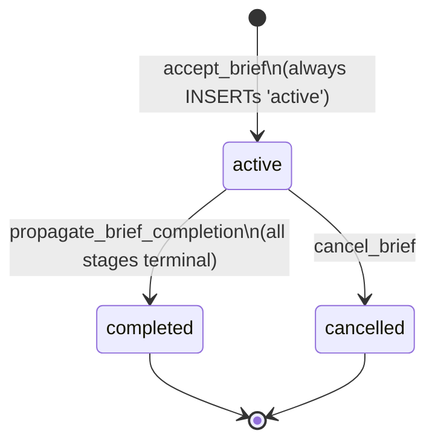

**Notes.** The CHECK currently allows `'planned'` and `'queued'`; both are
dead post-M-128 (P7 violation — flagged in §9 Q1).

### 4.2 BriefStage

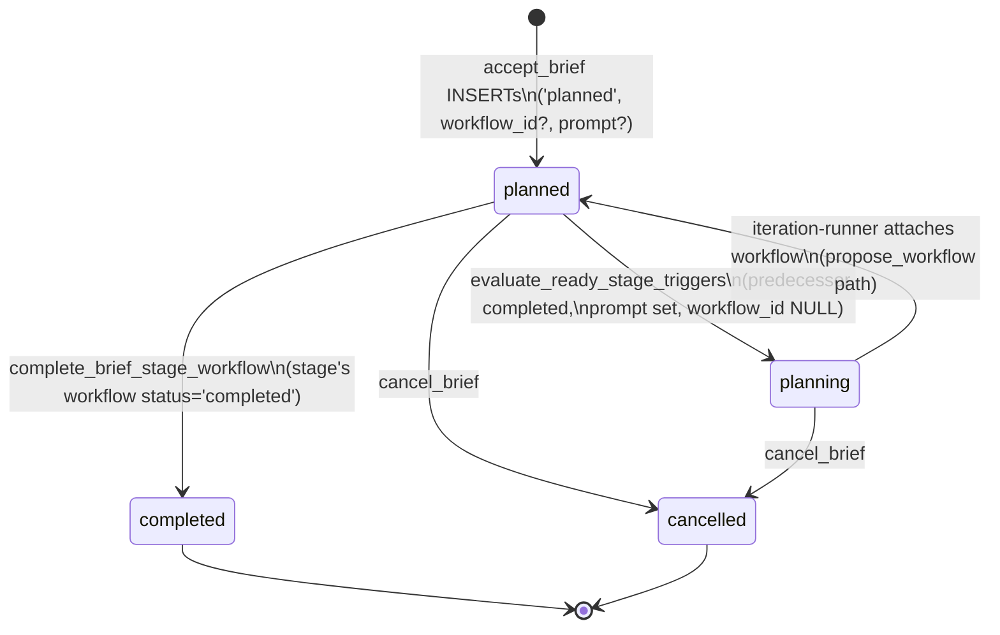

**Notes on the `planning→planned` round-trip.** When the push-model
evaluator invokes the Director with the stage's prompt, the stage moves to
`'planning'`. When the Director emits `propose_workflow` and the iteration
runner attaches the workflow, the stage flips back to `'planned'` (now
with workflow_id set) and remains there until the workflow completes.
This loses signal — there's no status that distinguishes "stage has no
workflow yet" from "stage has workflow, awaiting completion".

This is flagged as Q4 in §9 (proposed remedy: introduce `'ready'` or
`'workflow_attached'` as an intermediate state).

The CHECK currently allows `'approved'` and `'scheduled'`; both dead (Q5).

### 4.3 Workflow

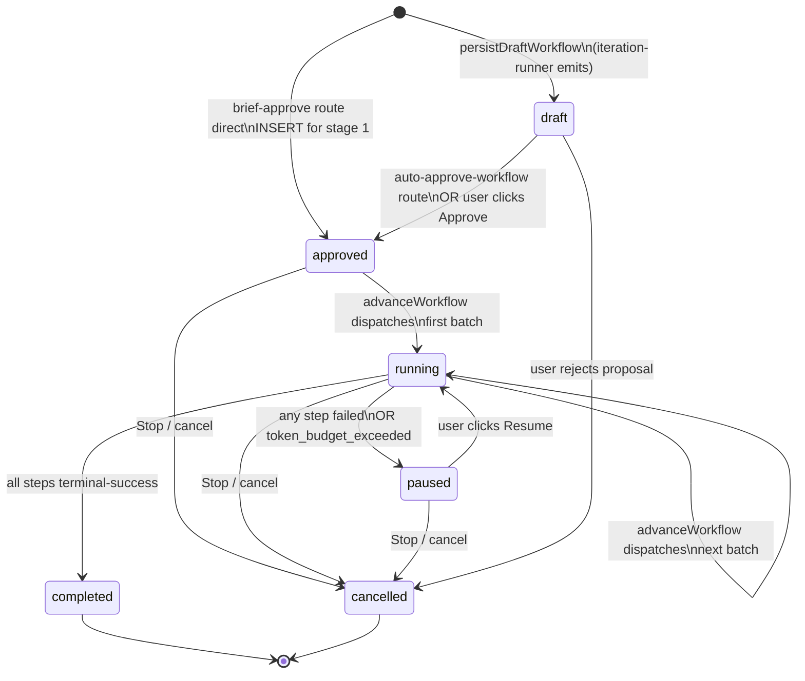

### 4.4 WorkflowStep

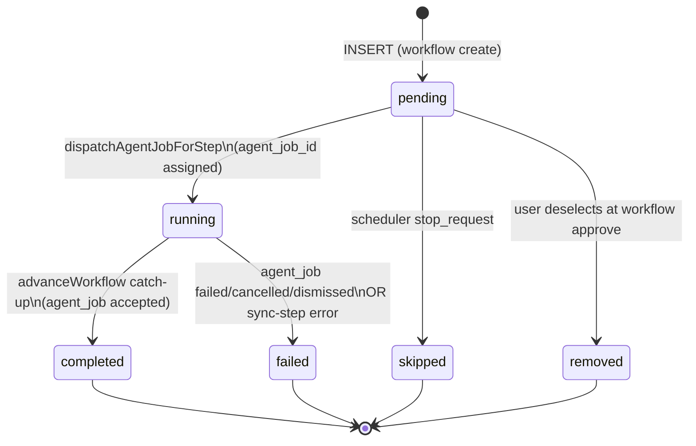

**Dependency satisfaction.** A pending step is dispatchable when every
referenced `depends_on_step_orders` entry has `status='completed'` (NOT
'skipped', NOT 'removed' — Q8).

### 4.5 AgentJob.status (business outcome)

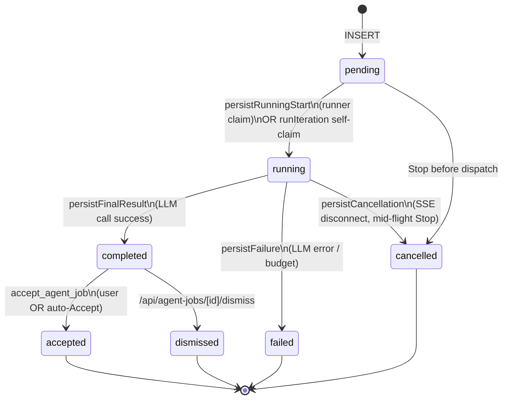

### 4.6 AgentJob.queue_status (queue lifecycle)

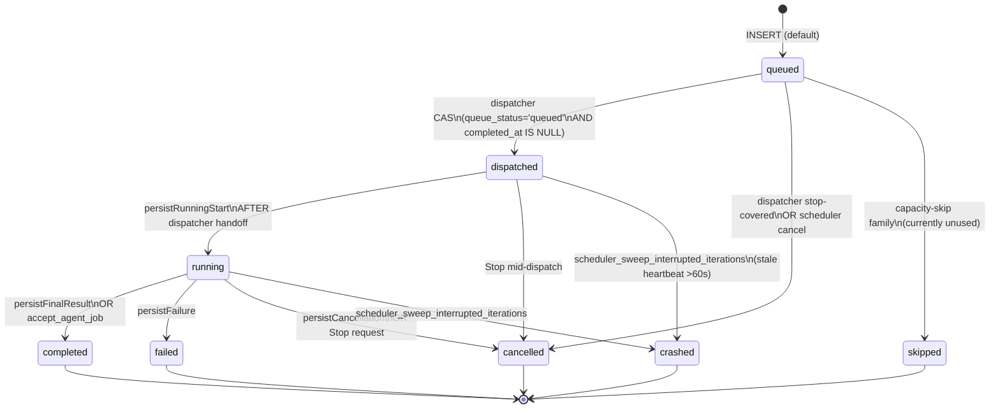

### 4.7 status × queue_status agreement table

| status | queue_status | Legal? | Meaning |
|---|---|---|---|
| pending | queued | ✓ | Just inserted, awaiting dispatch |
| pending | cancelled | ✓ | Stop before dispatch |
| running | dispatched | ✗ | **Transient at most** — runner should transition both to 'running' within ms of claim |
| running | running | ✓ | Runner actively executing |
| completed | completed | ✓ | Work finished, awaiting Accept (or already self-accepted) |
| accepted | completed | ✓ | Accepted (queue_status stays 'completed' — there is no 'accepted' queue value) |
| failed | failed | ✓ | Errored |
| cancelled | cancelled | ✓ | User/system cancelled |
| failed | crashed | ✓ | Sweep-detected stale heartbeat |
| **any other combination** | | ✗ | Drift; investigate |

**Critical:** the dispatcher transitioning `queue_status='dispatched'` does
NOT write `status`. The runner transitioning `status='running'` must ALSO
write `queue_status='running'` (P9 — runner owns this transition).

### 4.8 DirectorTurn

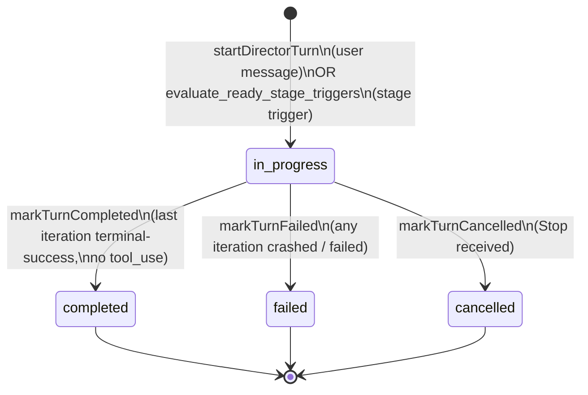

---

## 5. Message Bus

The system is **event-driven for hot paths**, with a **single 30s
reconcile sweep** for time-based wakeups and recovery. The 1-second
`dispatcher_tick` cron is dropped — the audit revealed it existed only to
notice newly-INSERTed `queued` agent_jobs (the existing UPDATE-trigger
covers completion cascade). Replacing it with an INSERT trigger is
strictly better: lower latency (10ms vs up to 1s), one less moving part.

### 5.1 pg_notify channels

| Channel | Fired by | Consumed by | Payload | Purpose |
|---|---|---|---|---|
| `dispatcher_tick_request` | DB trigger `trg_agent_jobs_notify_insert` AFTER INSERT WHEN `queue_status='queued'` (NEW) **OR** `request_dispatcher_tick()` called from the 30s reconcile sweep when due-scheduled jobs exist | TS listener → `runDispatcherTick()` | `{requested_at, cause}` | Wake the dispatcher on new queued work or scheduled-time arrival |
| `scheduler_completion` | DB trigger `trg_agent_jobs_notify_completion` AFTER UPDATE OF queue_status to terminal | TS listener → `runDispatcherTick()` | `{job_id, queue_status, status, triggered_by, ...}` | Cascade re-dispatch after a job completes |
| `batch_poll_request` | pg_cron `batch_poller` every 5min | TS listener → `pollAllInProgressBatches()` | `{requested_at}` | Anthropic batched_24h polling |
| `route_sample_request` | pg_cron `route_capacity_sampler` every minute | TS listener → `recordRouteCapacitySamples()` | `{requested_at}` | Metrics capture |
| `synthetic_probe_request` | pg_cron 3 probe schedules | (out-of-listener; documented integration) | `{probe_id}` | Synthetic probe trigger |

### 5.2 System events in `conversation_messages`

Emitted by SQL helper `_emit_system_event` (M-097) from RPCs.

| Event | Emitter | When | Payload |
|---|---|---|---|
| `stage_trigger_fired` | `evaluate_ready_stage_triggers` | trigger predicate satisfied | `{stage_id, stage_order, brief_id, prompt}` |
| `stage_completed` | `complete_brief_stage_workflow` | brief_stage advanced to completed | `{stage_id, workflow_id}` |
| `brief_completed` | `propagate_brief_completion` | brief advanced to completed | `{brief_id}` |
| `brief_activated` | `promote_next_queued_brief` | (dead post-M-128) | — |
| `cancel_cascade` | `cancel_brief` | user cancels brief | `{brief_id, pending_stages, completed_stages, reason}` |
| `stop` | Stop request route | user/system Stop | `{turn_id, requester_user_id}` |
| `resume` | Resume route | user resumes | `{turn_id}` |
| `failure_class_b/c/d/e` | runtime classification | failure detected | `{job_id, failure_class, error_message}` |

### 5.3 pg_cron schedules

After consolidation:

| Job | Schedule | Calls | Notes |
|---|---|---|---|
| `reconcile_orchestration_state` | every 30s | `reconcile_orchestration_state()` (NEW; combines stale-heartbeat sweep + reservation refund + orphan turn sweep + scheduled-job wake + workflow/brief stuck-state recovery — see §12.3) | Single sweep replaces M-099 + M-107 + M-166 + the time-based dispatcher wake. |
| `evaluate_ready_stage_triggers` | every 30s | `evaluate_ready_stage_triggers()` | Push-model trigger evaluator. Could fold into reconcile but kept separate because it INSERTs new agent_jobs (write path), not just reconciliation. |
| `batch_poller` | every 5min | `request_batch_poll()` | Anthropic batched_24h. |
| `route_capacity_sampler` | every 1min | `request_route_capacity_sample()` | Metrics. |
| `metrics_minute_rollup` | every 1min | `rollup_metrics_minute()` | Metrics rollup. |
| `purge_raw_metric_samples` | daily 04:00 UTC | retention | Metrics retention. |
| `rollover_org_periods` | daily 03:00 UTC | per-org usage_credits reset | Billing. |
| `export_purge_expired` / `export_recovery_sweep` | as scheduled | export pipeline retention | Phase 7. |
| `synthetic_probe_*` (3) | daily 04:15 / 30 / 45 UTC | `request_synthetic_probe(<id>)` | Admin probes. |

**Dropped:** `dispatcher_tick` (1s); `scheduler_sweep_interrupted_iterations` (30s); `scheduler_sweep_throttle_reservations` (30s) — folded into the single reconcile sweep.

### 5.4 HTTP fallbacks

| Route | Purpose |
|---|---|
| `POST /api/cron/dispatcher-tick` | Vercel-Cron fallback for `dispatcher_tick_request`; also manual recovery |
| `POST /api/cron/poll-batches` | Vercel-Cron fallback for `batch_poll_request` |
| `POST /api/cron/period-rollover` | Daily org-period rollover (M-141 backup) |
| `POST /api/cron/run-probes` | Synthetic probe trigger |
| `POST /api/director/turns/[turnId]/auto-approve-workflow` | Internal: iteration-runner → server, on Director-emitted propose_workflow with auto-approve enabled |

---

## 6. Actor Contracts

For each actor: entry trigger, preconditions, the writes it performs
(WITH the WHERE-guard on each), exit conditions, and what it must NOT
write.

### 6.1 Browser (user actions)

- **Click Approve on BriefProposalCard.** POSTs to
  `/api/brief/proposals/approve`. Body: `{document_id, proposal,
  auto_approve_workflow_proposals?}`.
- **Click Accept on AgentTab.** POSTs to `/api/agent-jobs/[jobId]/accept`.
- **Click Dismiss on AgentTab.** POSTs to `/api/agent-jobs/[jobId]/dismiss`.
- **Click Stop on a turn.** POSTs to `/api/director/turns/[turnId]/stop`.
- **Click Cancel on a brief.** POSTs to `/api/brief/[briefId]/cancel`.
- **Click Lock / Unlock on a node.** POSTs to `/api/nodes/[id]/lock`.

**Must not write any column directly** — RLS prevents it; server is sole
writer.

### 6.2 API route: `/api/brief/proposals/approve`

- **Entry:** user POST with approved brief.
- **Preconditions:** user session, valid proposal shape (Zod), document
  exists.
- **Writes:**
  1. `accept_brief` RPC (INSERTs `briefs` + `brief_stages`).
  2. If body flag set: `UPDATE briefs SET auto_approve_workflow_proposals=true WHERE id=...`.
  3. `INSERT workflows (status='approved', approved_at=NOW())` for stage 1.
  4. `INSERT workflow_steps (status='pending')` rows.
  5. `UPDATE brief_stages SET workflow_id=... WHERE id=<stage1.id>`.
  6. `waitUntil(advanceWorkflow(workflow.id))`.
- **Must not:** dispatch agent_jobs directly (P2).

### 6.3 API route: `/api/director/turns/[turnId]/auto-approve-workflow`

- **Entry:** iteration-runner POST when Director emits propose_workflow on
  an auto-approve-enabled brief. Authenticated via `CRON_AUTH_TOKEN` or
  user session.
- **Preconditions:** workflow linked to turn via `conversation_messages.workflow_id`;
  `workflow.status='draft'`; parent brief has `auto_approve_workflow_proposals=true`.
- **Writes:**
  1. `UPDATE workflows SET status='approved', approved_at=NOW() WHERE id=<wf.id> AND status='draft'`.
  2. `waitUntil(advanceWorkflow(workflowId))`.
- **Must not:** INSERT agent_jobs directly (P2 — was a bug, fixed
  2026-05-22). The route does NOT touch `brief_stages.status` either; that
  was set by the iteration-runner when it attached the workflow.

### 6.4 Dispatcher (`runDispatcherTick`)

- **Entry:** pg_notify on `dispatcher_tick_request` or
  `scheduler_completion`, or HTTP `POST /api/cron/dispatcher-tick`.
- **Reads:**
  `agent_jobs WHERE queue_status='queued' AND completed_at IS NULL AND
  (scheduled_at IS NULL OR scheduled_at<=NOW()) ORDER BY queued_at LIMIT N`.
- **Writes:**
  - **CAS claim:**
    ```sql
    UPDATE agent_jobs
       SET queue_status='dispatched',
           dispatched_at=NOW(),
           reservation_id=...,
           wfq_vft_at_dispatch=...
     WHERE id=$1 AND queue_status='queued' AND completed_at IS NULL
    ```
  - **Stop-covered cancel:**
    ```sql
    UPDATE agent_jobs
       SET queue_status='cancelled',
           status='failed',
           failure_class='B',
           error_message='cancelled_by_stop_request',
           completed_at=NOW()
     WHERE id=$1 AND queue_status='queued'
    ```
- **Must not write:** `status` on the CAS path (the runner owns business
  outcome — P9), `started_at` (the runner owns that — set by
  `persistRunningStart`).
- **Exit:** writes a `dispatcher_tick_samples` row; hands each claimed
  candidate to `handoffToRunner` → `runIteration` (director_iteration) OR
  `runAgentJob` (else).

### 6.5 Agent Runner (`runAgentJob`)

- **Entry:** dispatcher handoff OR `waitUntil` from `dispatchAgentJobForStep`.
- **Preconditions:** `agent_jobs.status='pending'`. (`loadJobAndProfile`
  filters this; returns `job_not_pending` and skips otherwise.)
- **Writes via `lib/agent/job-lifecycle.ts`:**
  - **`persistRunningStart`:**
    `status='running', queue_status='running', started_at, last_heartbeat_at`
    WHERE `status='pending'`.
  - **Heartbeat:** `last_heartbeat_at` every `agent.heartbeat_interval_ms`
    WHERE `status='running'`.
  - **`persistFinalResult` (success):**
    `status='completed', queue_status='completed', completed_at, tokens, cost, result_*`
    WHERE `status≠'cancelled'`.
  - **`persistFailure`:**
    `status='failed', queue_status='failed', error_message, completed_at`
    WHERE `status≠'cancelled'`.
  - **`persistCancellation`:**
    `status='cancelled', queue_status='cancelled', error_message, completed_at`
    WHERE `status IN ('running','pending')`.
- **Exit-side effects:** calls `notifyWorkflowIfStep(triggered_by)` which
  invokes `advanceWorkflow(workflow_id)` if the job was a workflow_step.

### 6.6 Iteration Runner (`runIteration`)

- **Entry:** dispatcher handoff for `operation_type='director_iteration'`.
- **Preconditions:** `agent_jobs.queue_status IN ('dispatched','queued')`.
  (Self-claim filter — `lib/director/iteration-runner.ts:431-434`.)
- **Writes on agent_jobs:**
  - Self-claim: `status='running', queue_status='running', last_heartbeat_at`.
  - Periodic heartbeat: `last_heartbeat_at` every 15s while streaming.
  - On chain (tool_use stop_reason): INSERT next iteration row
    (`status='pending', queue_status='queued', parent_iteration_id=<this>`).
  - On terminal-success: `status='completed', queue_status='completed',
    completed_at, model_id, tokens, cost, iteration_state`.
  - On Stop: `markJobCancelled` →
    `status='failed', queue_status='cancelled', failure_class='B', error_message, completed_at`.
  - On error: `markJobFailed` →
    `status='failed', queue_status='failed', failure_class, error_message, completed_at`.
- **Writes on director_turns:** `markTurnCompleted/Cancelled/Failed`.
- **Writes on brief_stages:** when Director emits `propose_workflow`,
  attaches the workflow:
  `UPDATE brief_stages SET workflow_id=<wf>, status='planned' WHERE id=<stage> AND status='planning'`.
- **Writes on workflows:** `persistDraftWorkflow` INSERTs
  `workflows (status='draft')` + `workflow_steps (status='pending')` rows.
- **Writes on conversation_messages:** assistant messages (interim + final),
  `workflow_id` link on assistant message that emitted a proposal.
- **HTTP side-effects:** when propose_workflow on auto-approve-enabled
  brief, POSTs to `/api/director/turns/[turnId]/auto-approve-workflow`.

### 6.7 Workflow Executor (`advanceWorkflow`)

- **Entry:** called by:
  - Brief approve route (after stage 1 workflow created).
  - Auto-approve-workflow route (after Director-planned workflow approved).
  - User-driven workflows/[id]/approve route.
  - Agent runner terminal → `notifyWorkflowIfStep` → `advanceWorkflow`.
  - Synchronous step completion (`comment` op type runs inline).
- **Reads:** workflow + workflow_steps for workflow_id.
- **Catch-up step:** for each `workflow_steps WHERE status='running' AND agent_job_id IS NOT NULL`:
  - Read `agent_jobs.status`.
  - If `'completed'`: call `accept_agent_job` RPC → set step `'completed'`.
  - If `'accepted'`: set step `'completed'` (catch-up only — usually the
    accept_agent_job RPC path also sets the step).
  - If `'failed' / 'cancelled' / 'dismissed'`: set step `'failed'` with
    error_message.
- **Promotion step:**
  - If all `workflow_steps.status` ∈ `('completed','skipped','removed')`:
    `UPDATE workflows SET status='completed', completed_at=NOW()` and call
    `complete_brief_stage_workflow(workflow_id)` RPC.
  - If first dispatchable batch: `UPDATE workflows SET status='running'`.
- **Dispatch step:** for each ready step (`status='pending'`, deps
  satisfied) up to `agent.director_max_concurrent_dispatch`:
  `dispatchAgentJobForStep`.

### 6.8 `dispatchAgentJobForStep` (within workflow-executor)

- **Resolves agent_profile** by `(operation_type, target_node.node_type)`
  with refine fallback (`refine_<type>` → `refine`).
- **Auto-creates context node** for `generate_context` against structural
  target (writes a new `nodes` row of `node_category='context'`).
- **Runs token budget gate** (`checkTokenBudget`). On exceeded:
  `workflows.status='paused'`, `workflow_steps.status='failed'`.
- **Writes:**
  - INSERT `agent_jobs` (`status='pending'`, `operation_type`, `profile_id`,
    `node_id`, `context_snapshot`, `target_node_version_at_capture`,
    `triggered_by='workflow_step:<step_id>:<workflow_id>'`). Relies on
    `queue_status` DEFAULT `'queued'`.
  - UPDATE `workflow_steps SET status='running', started_at=NOW(), agent_job_id=<jobRow.id>`.
- **Fires:** `waitUntil(runAgentJob(jobRow.id))`. **Bypasses the
  dispatcher** — see §9 Q2 for the design tension.

### 6.9 SQL RPCs

#### `accept_brief(p_document_id uuid, p_goal_text text, p_stages jsonb)`

- INSERT `briefs (status='active', cause='user_initial', goal_text, current_stage_id=<first_stage>)`.
- INSERT `brief_stages (status='planned', prompt=NULLIF(s->>'prompt',''), workflow_id=NULL)` for each stage.
- Returns `{brief, stages, initial_status, queue_position}`.

#### `accept_agent_job(p_job_id uuid, p_actor_id text, p_target_summary text, p_target_prose text, p_target_notes text, p_target_metadata jsonb, p_child_nodes jsonb)`

- Idempotent on `agent_jobs.status='accepted'`.
- Requires `agent_jobs.status='completed'` (else raises).
- `FOR UPDATE` on agent_jobs + nodes.
- Optimistic version check (`target_node_version_at_capture = nodes.version`).
- INSERT `node_versions` snapshot.
- UPDATE `nodes` (summary/prose/notes/metadata) with GUC-driven version bump.
- INSERT child `nodes` rows for `expand`.
- **Final UPDATE:** `agent_jobs SET status='accepted', queue_status='completed', completed_at=NOW()`.

#### `complete_brief_stage_workflow(p_workflow_id uuid)`

- Idempotent on `brief_stages.status='completed'`.
- UPDATE `brief_stages SET status='completed', completed_at=NOW()` for the
  stage linked to this workflow.
- Emit `stage_completed` system event.
- Advance `briefs.current_stage_id` to next planned stage OR call
  `propagate_brief_completion`.
- Inline call to `evaluate_ready_stage_triggers()` (push-model).

#### `propagate_brief_completion(p_brief_id uuid)`

- Idempotent on `briefs.status='completed'` / `'cancelled'`.
- Count pending stages; if zero:
  `UPDATE briefs SET status='completed', completed_at=NOW(), current_stage_id=NULL`.
- Emit `brief_completed` system event.

#### `evaluate_ready_stage_triggers()`

- For each `brief_stages.status='planned' AND trigger_type='after_stage'
  AND brief.status='active'`:
  - Skip if `workflow_id IS NOT NULL` (already planned).
  - Skip if `prompt IS NULL` (defence-in-depth).
  - Skip if predecessor stage not `status='completed'`.
  - Skip if an in-flight `director_iteration` exists on the conversation (H-23).
- UPDATE `brief_stages SET status='planning'`.
- Emit `stage_trigger_fired` system event.
- INSERT `director_turns (status='in_progress')`.
- INSERT `agent_jobs (operation_type='director_iteration', status='pending', queue_status='queued', cause='stage_trigger', iteration_state={...}, ...)`.

#### `check_node_writable(p_node_id uuid, p_requesting_user_id uuid)`

- Returns JSONB `{writable, blocker, details}`.
- Blocker priority: `author_locked` → `node_in_use` → `node_in_progress`.
- `node_in_progress` fires on
  `agent_jobs WHERE node_id=$1 AND (queue_status IN ('queued','dispatched','running') OR status='completed')`.

#### `cancel_brief(p_brief_id uuid, p_reason text)`

- Validates `briefs.status ∈ ('planned','queued','active')`.
- UPDATE non-terminal `brief_stages SET status='cancelled', completed_at=NOW()`.
- UPDATE `briefs SET status='cancelled', cancelled_at=NOW(), current_stage_id=NULL`.
- Emit `cancel_cascade` event.

#### `request_dispatcher_tick()`

- `PERFORM pg_notify('dispatcher_tick_request', jsonb_build_object('requested_at', NOW())::TEXT)`.

### 6.10 Database triggers

- **`trg_agent_jobs_notify_completion`** (M-109): AFTER UPDATE OF
  `queue_status` ON `agent_jobs` WHEN NEW.queue_status terminal AND
  changed. Calls `pg_notify('scheduler_completion', ...)`.
- **`trg_director_turns_rollup`** (M-109): AFTER UPDATE OF `queue_status`
  on director_iteration jobs WHEN terminal. Updates
  `director_turns.iteration_count`, `total_*_tokens`, `total_cost_credits`.

---

## 7. Process Flows

### 7.1 Flow A — User approves a single-stage workflow brief (happy path)

```mermaid
sequenceDiagram
  participant U as User (Browser)
  participant R as POST /api/brief/proposals/approve
  participant DB as Postgres
  participant WE as advanceWorkflow
  participant AR as Agent Runner
  participant L as TS Listener / Dispatcher

  U->>R: POST {document_id, proposal}
  R->>DB: accept_brief RPC
  DB-->>R: brief + stages
  R->>DB: INSERT workflows (approved)\nINSERT workflow_steps (pending)\nUPDATE brief_stages.workflow_id
  R->>WE: waitUntil(advanceWorkflow)
  R-->>U: 200 OK
  WE->>DB: UPDATE workflows status='running'
  WE->>DB: dispatchAgentJobForStep:\nINSERT agent_jobs (pending, queued)\nUPDATE workflow_steps (running, agent_job_id)
  WE->>AR: waitUntil(runAgentJob)
  AR->>DB: persistRunningStart (status=running,\nqueue_status=running)
  AR->>AR: LLM call (streaming)
  AR->>DB: persistFinalResult (status=completed,\nqueue_status=completed)
  DB->>L: NOTIFY scheduler_completion
  AR->>WE: notifyWorkflowIfStep → advanceWorkflow
  WE->>DB: accept_agent_job RPC\n(applies result to nodes;\nstatus=accepted)
  WE->>DB: UPDATE workflow_steps status='completed'
  WE->>DB: UPDATE workflows status='completed'
  WE->>DB: complete_brief_stage_workflow RPC\n(stage='completed',\npropagate_brief_completion,\nevaluate_ready_stage_triggers)
  DB->>DB: brief='completed' (single stage,\nno more triggers)
```

**Note** the user-Accept gate is currently bypassed in this auto-Accept
flow because the workflow-executor's catch-up calls `accept_agent_job`
directly when the agent_job is `status='completed'`. For content-modifying
ops where the user wants to review before applying, this is configurable
via the workflow-executor's catch-up condition (see Q3).

### 7.2 Flow B — User approves a 2-stage brief (workflow + prompt)

Same as 7.1 up to "complete_brief_stage_workflow" for stage 1, which now
triggers stage 2:

```mermaid
sequenceDiagram
  participant DB as Postgres
  participant L as TS Listener
  participant DR as Dispatcher
  participant IR as Iteration Runner
  participant AAR as POST /api/director/turns/[id]/auto-approve-workflow
  participant WE as advanceWorkflow

  Note over DB: stage 1 completed; complete_brief_stage_workflow → \nevaluate_ready_stage_triggers
  DB->>DB: brief_stages[2].status: planned → planning
  DB->>DB: INSERT system event stage_trigger_fired
  DB->>DB: INSERT director_turns (in_progress)
  DB->>DB: INSERT agent_jobs (director_iteration, queued)
  DB->>L: NOTIFY scheduler_completion (cascade)
  Note over L: 30s pg_cron OR push notify
  L->>DR: runDispatcherTick
  DR->>DB: CAS claim (queue_status: queued→dispatched)
  DR->>IR: handoffToRunner (runIteration)
  IR->>DB: self-claim (status=running, queue_status=running)
  IR->>IR: Director loop (LLM + tool calls)
  IR->>DB: persistDraftWorkflow (workflows: draft,\nworkflow_steps: pending)
  IR->>DB: UPDATE brief_stages workflow_id=<wf>,\nstatus='planned' (planning→planned)
  IR->>AAR: POST {turnId} + CRON_AUTH_TOKEN
  AAR->>DB: UPDATE workflows status='draft'→'approved'
  AAR->>WE: waitUntil(advanceWorkflow)
  WE->>DB: dispatchAgentJobForStep (per step)
  Note over WE: Same as 7.1 from here
  IR->>DB: persistFinalResult on iteration\nmarkTurnCompleted
```

### 7.3 Flow C — Workflow step completion advances workflow (multi-step)

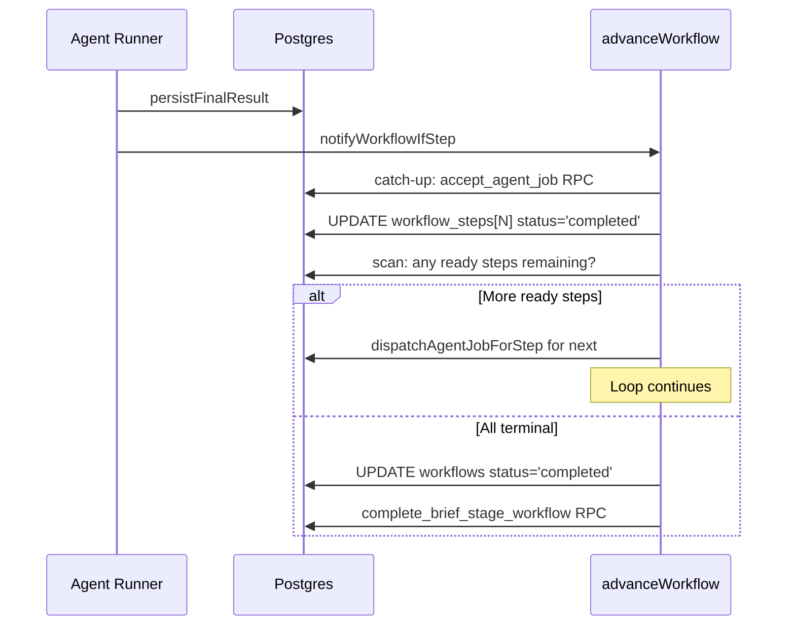

### 7.4 Flow D — User Stop on a turn

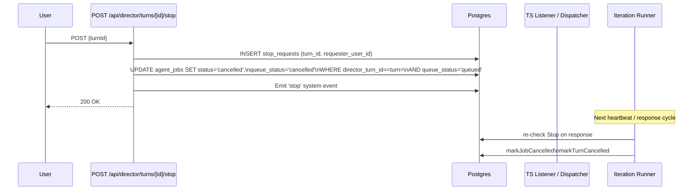

### 7.5 Flow E — Heartbeat sweep recovers stale jobs

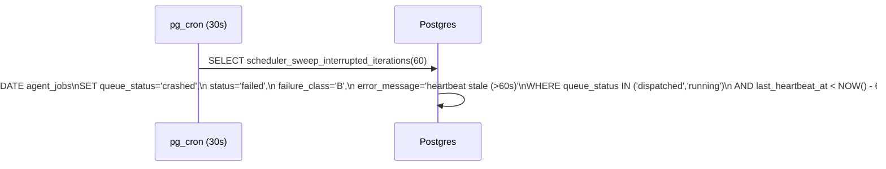

---

## 8. Invariants

These MUST hold at all times. A violation is a bug.

**I1.** `agent_jobs.completed_at IS NOT NULL` ⇔ `status` ∈ terminal ⇔ `queue_status` ∈ terminal.

**I2.** `agent_jobs.status='accepted'` ⇒ `queue_status='completed'`. There is no `queue_status='accepted'`.

**I3.** `workflow_steps.status='completed'` ⇒ the linked `agent_job.status` ∈ `('accepted','completed')` OR the step is synchronous (e.g. `comment` op type).

**I4.** `workflows.status='completed'` ⇒ every `workflow_step.status` ∈ `('completed','skipped','removed')`.

**I5.** `briefs.status='completed'` ⇒ every `brief_stage.status` ∈ `('completed','cancelled','skipped')`.

**I6.** For any document, at most one `briefs.status='active'` row.

**I7.** Every non-terminal `brief_stage` row has `workflow_id IS NOT NULL` OR `prompt IS NOT NULL` (planning source XOR — enforced in Zod).

**I8.** For any conversation, at most one `director_turns.status='in_progress'` row.

**I9.** The dispatcher's CAS never matches a row with `completed_at IS NOT NULL`.

**I10.** Every `agent_jobs` UPDATE that transitions to a terminal `status` also transitions `queue_status` to the matching terminal value (table in §4.7).

**I11.** Every brief/stage/workflow state transition that affects the user surface emits a system event in `conversation_messages` (within the same transaction as the state UPDATE, where the actor is an RPC; or in the same request as the state UPDATE, where the actor is an API route).

**I12.** A `workflow_step.status='running'` row has `agent_job_id IS NOT NULL`.

**I13.** Every `agent_jobs` row created by the workflow-executor's `dispatchAgentJobForStep` has `profile_id IS NOT NULL`, `context_snapshot IS NOT NULL`, and `target_node_version_at_capture IS NOT NULL`.

**I14.** When `briefs.auto_approve_workflow_proposals=true` and the iteration-runner emits a `propose_workflow` artefact, the resulting workflow transitions `draft → approved → running` within the same dispatch cycle (no manual approval step).

---

## 9. Resolved Decisions

All ten questions raised during initial drafting were resolved by the
user 2026-05-22. The decisions are recorded below; each transcribes to
a code-audit action item.

### Q1. Drop dead enum values from `briefs.status`?

The CHECK currently allows `('planned','queued','active','completed','cancelled')`. Post-M-128:
- `'planned'` is never written (`accept_brief` always INSERTs `'active'`).
- `'queued'` is never reachable (multi-active was deprecated in M-183).

**Proposal:** drop both. CHECK becomes `('active','completed','cancelled')`.

### Q2. Stage status round-trip — `planning → planned`?

When the Director plans a prompt-deferred stage, the stage flips
`planning → planned` once the workflow is attached. The `'planned'` state
is overloaded — it means both "fresh, no workflow yet" and "workflow
attached, awaiting completion".

**Proposal:** introduce `'ready'` (or `'workflow_attached'`) as the state
for "workflow attached, awaiting completion". State diagram becomes
`planned → planning → ready → completed`.

**Alternative:** treat workflow_id as the canonical signal; `'planned'`
distinguished by presence/absence of workflow_id. Status column stays
`('planned','planning','completed','cancelled')`. Simpler but less explicit.

### Q3. Auto-Accept on workflow_step jobs

Currently `advanceWorkflow`'s catch-up calls `accept_agent_job` for any
`status='completed'` job. This auto-applies the result to the node
without an author review.

**For prompt-deferred stage 2 synthesise of beats** this is what we want —
the brief authorizes the entire operation up front.

**For interactive user-driven workflows** the user expects a review gate.

**Proposal:** carry an `auto_accept` flag on `workflow_steps` (set from the
brief's `auto_approve_workflow_proposals` OR per-step from the proposal
artefact). The catch-up only auto-accepts when this flag is true.

### Q4. Single dispatch path or two?

`dispatchAgentJobForStep` bypasses the dispatcher (`waitUntil(runAgentJob)`)
for workflow_step jobs. Only `director_iteration` jobs flow through the
WFQ dispatcher.

**Decision (2026-05-22): Option A — keep the bypass.** Workflow_step jobs
run via `waitUntil(runAgentJob)` directly from `dispatchAgentJobForStep`,
without entering the dispatcher's CAS path. The bypass is documented
explicitly in §6.8 and acknowledged as a deliberate latency optimisation.
Metrics for these jobs do not flow through the dispatcher's
`dispatcher_tick_samples`; that is acceptable.

### Q5. `evaluate_ready_stage_triggers` hard-codes prompt version

The function pins `iteration_state.system_prompt_version='1.24'`. Director
config has moved to v1.25 / v1.26.

**Proposal:** read the production version from `director_configs WHERE status='production'` instead of hardcoding.

### Q6. Cancel/dismiss routes don't update `queue_status`

`/api/agent-jobs/[jobId]/cancel`, `/api/agent-jobs/[jobId]/dismiss`, and
`/api/scheduler/jobs/[jobId]/cancel` write `status` but not `queue_status`.
This violates I1 / I10.

**Proposal:** add `queue_status='cancelled'` (or `'completed'` for dismiss)
to each.

### Q7. Workflow-step `'removed'` doesn't satisfy dependencies

If a workflow has step 1 depending on step 0, and the user deselects
step 0 at approve-time (`status='removed'`), the dispatcher's
`dependencyResolved` does NOT treat removed deps as satisfied, so step 1
is never dispatched.

**Proposal:** treat `'completed'`, `'skipped'`, AND `'removed'` as
satisfied dependencies.

### Q8. `recordTokensOnly` leaves the job in a non-terminal state

If the LLM call returns AND the cancellation flag is set, the runner calls
`recordTokensOnly` (which only writes tokens) and returns. The row stays
in `status='running'`. The sweep eventually marks it crashed, but for up
to 60s the node is locked with no recovery.

**Proposal:** `recordTokensOnly` should also write
`status='cancelled', queue_status='cancelled', completed_at=NOW()` so the
terminal write is atomic with token capture.

### Q9. Vestigial values in `brief_stages.status`

CHECK allows `'approved'` and `'scheduled'`. Neither is written anywhere.

**Proposal:** drop both in a migration that re-narrows the CHECK.

### Q10. `briefs.cause='sequence_promotion'` is dead

`promote_next_queued_brief` is the only writer; it's only called from
`cancel_brief` and `propagate_brief_completion`'s queue-promotion paths.
With multi-active dropped (M-128), there are never queued briefs to
promote.

**Proposal:** drop `'sequence_promotion'` from the CHECK; drop the
`promote_next_queued_brief` RPC; drop the queue-promotion calls in
`cancel_brief` and `propagate_brief_completion`.

---

## 11. Formal State Transition Tables — Completeness Proof

This section makes the state machines exhaustive. For each entity:

1. **States** — the closed set of legal values.
2. **Events** — the closed set of inputs that can trigger transitions.
3. **Transition matrix** — every (state × event) cell is defined as
   either `→ <new-state>`, `no-op`, or `error` (with a recovery path
   stated in §12).
4. **Coverage statement** — the matrix is total: no input renders an
   undefined or unknown state.

If a row of any table ever shows `undefined`, the spec is incomplete and
the system can reach unknown state. Every row below has a defined cell.

The transition functions are written for the **declared owner** of each
column (see Appendix A). Other actors must not write the column; if they
do, the audit query in §13 will flag the violation.

### 11.1 Brief

**States:**

| State | Meaning |
|---|---|
| `active` | Brief is approved and operationally in flight. At most one per document. |
| `completed` | All stages terminal-success. Brief is closed. |
| `cancelled` | User or cascade-cancelled. Brief is closed. |

(Vestigial `'planned'` and `'queued'` are dropped per Q1.)

**Events:**

| Event | Source | Definition |
|---|---|---|
| E_ACCEPT | `accept_brief` RPC | User approved a propose_brief artefact. |
| E_STAGE_TERMINAL | Cascade from BriefStage termination | A child brief_stage just transitioned to a terminal state. |
| E_CANCEL | `cancel_brief` RPC | User clicks Cancel on the brief. |
| E_RECONCILE | 30s sweep | Periodic state-integrity check. |

**Transition matrix:**

|  Current  | E_ACCEPT | E_STAGE_TERMINAL | E_CANCEL | E_RECONCILE |
|---|---|---|---|---|
| (none) | → active (INSERT) | n/a | error: no brief | n/a |
| active | error: one-active invariant | call `propagate_brief_completion`: if all stages terminal-success → completed; else stay active | → cancelled + cascade | if all stages terminal-success AND status='active' → propagate (drift fix) |
| completed | error: brief already terminal | no-op (idempotent) | no-op (already terminal) | no-op |
| cancelled | error: brief already terminal | no-op | no-op (idempotent) | no-op |

**Coverage:** 4 states × 4 events = 16 cells. All defined.

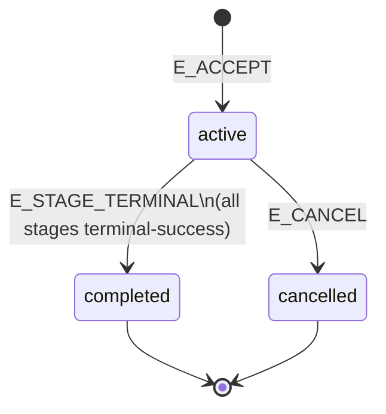

### 11.2 BriefStage

**States** (Q2 — adds `ready` and `failed`):

| State | Meaning |
|---|---|
| `planned` | Initial; no workflow attached yet. |
| `planning` | System has invoked Director to plan this stage. |
| `ready` | Workflow attached; ready to run or already running. |
| `completed` | Stage's workflow ran to terminal-success. |
| `cancelled` | Cascade-cancelled by brief or stop request. |
| `failed` | Stage couldn't be completed (planning exhausted retries OR workflow failed terminally). |

**Events:**

| Event | Source | Definition |
|---|---|---|
| E_INSERT | `accept_brief` | INSERT. Default `planned`. |
| E_TRIGGER | `evaluate_ready_stage_triggers` | Trigger predicate true: predecessor terminal, prompt set, workflow_id NULL, brief active. |
| E_WF_ATTACH | iteration-runner (propose_workflow) OR brief approve route (stage 1 workflow-bound) | Workflow_id set on this stage. |
| E_WF_DONE | `complete_brief_stage_workflow` | The attached workflow reached `completed`. |
| E_WF_TERMINAL_FAIL | `complete_brief_stage_workflow` (when WF cancelled/permanently-failed) | Workflow ended in a terminal-failure state and cannot be retried. |
| E_PLAN_FAIL | iteration-runner expected-output check (Q-D) | Director iteration ended without producing propose_workflow. |
| E_CANCEL | `cancel_brief` | Brief is being cancelled; cascade to all non-terminal stages. |
| E_RECONCILE | 30s sweep | Stage stuck in non-terminal state with no in-flight work. |

**Transition matrix:**

|  Current | E_INSERT | E_TRIGGER | E_WF_ATTACH | E_WF_DONE | E_WF_TERMINAL_FAIL | E_PLAN_FAIL | E_CANCEL | E_RECONCILE |
|---|---|---|---|---|---|---|---|---|
| (none) | → planned | n/a | n/a | n/a | n/a | n/a | n/a | n/a |
| planned | error: already exists | → planning (if has prompt AND predecessor terminal) | → ready (workflow-bound path: route INSERTs workflow then UPDATEs workflow_id + status atomically) | n/a | n/a | n/a | → cancelled | no-op (the brief sweep covers stuck cases at brief level) |
| planning | error | no-op (already planning) | → ready (Director emitted propose_workflow, iteration-runner attached) | n/a | n/a | retry: → planned + `planning_retry_count++` (or → failed if `>= brief.max_planning_retries`) | → cancelled | if `planning` for > `brief.planning_stale_threshold_seconds` AND no in-flight director_iteration on conversation → planned (treat as PLAN_FAIL) |
| ready | error | no-op | no-op (already attached) | → completed | → failed | n/a | → cancelled | no-op |
| completed | error | no-op | no-op | no-op (idempotent) | no-op | no-op | no-op | no-op |
| cancelled | error | no-op | no-op | no-op | no-op | no-op | no-op | no-op |
| failed | error | no-op (or admin-driven retry to planned — see §12.4) | no-op | no-op | no-op | no-op | no-op | no-op |

**Coverage:** 7 states × 8 events = 56 cells. All defined.

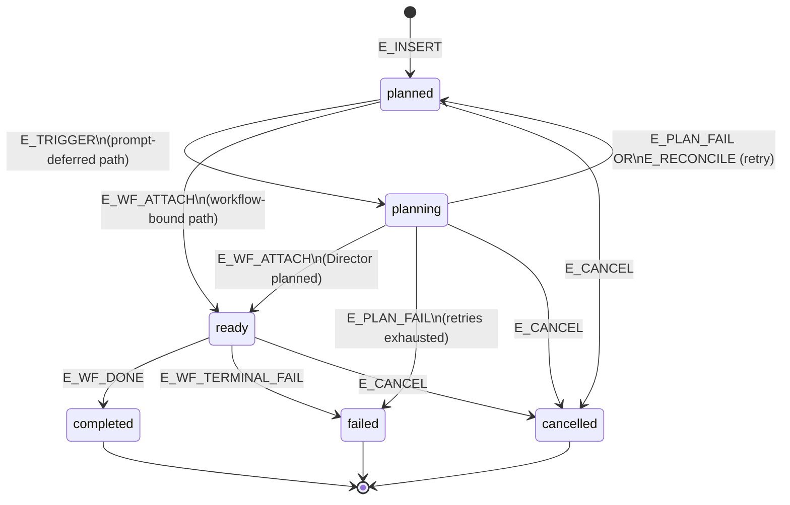

**`planning_retry_count`:** new INTEGER column on `brief_stages` (default
0). Incremented each PLAN_FAIL or RECONCILE-detected stuck-planning.
When >= `brief.max_planning_retries` (platform_config; default 3), the
stage transitions to `failed` and the brief enters cascade-decision: if
brief has any failed stage and `briefs.fail_on_stage_failure` (per-brief
flag; default true), the brief itself moves to `cancelled` with a
`stage_failed` event. If the flag is false, the failed stage is skipped
and brief proceeds.

### 11.3 Workflow

**States:**

| State | Meaning |
|---|---|
| `draft` | Director emitted this workflow proposal; awaiting approval. |
| `approved` | Approval applied; ready for `advanceWorkflow` to dispatch first batch. |
| `running` | At least one step has dispatched. |
| `paused` | A step failed or budget exceeded; advanceWorkflow stopped progressing. |
| `completed` | All steps terminal-success. |
| `cancelled` | User cancelled OR cascade from brief cancel. |

**Events:**

| Event | Source | Definition |
|---|---|---|
| E_PERSIST | `persistDraftWorkflow` | Iteration-runner saves Director-proposed workflow. |
| E_APPROVE | Brief approve route, auto-approve route, user approve route | Workflow approved. |
| E_DISPATCH_FIRST | `advanceWorkflow` | First step dispatched in this workflow's lifetime. |
| E_STEP_TERMINAL | `runAgentJob` → `notifyWorkflowIfStep` | A child step transitioned to terminal state. |
| E_STEP_FAIL | A child step entered `failed` | (covered by E_STEP_TERMINAL with branch) |
| E_RESUME | `/workflows/[id]/resume` | User clicks Resume on a paused workflow. |
| E_CANCEL | Cancel route OR cascade from brief cancel | Cancel. |
| E_RECONCILE | 30s sweep | Stuck-state recovery. |

**Transition matrix:**

|  Current | E_PERSIST | E_APPROVE | E_DISPATCH_FIRST | E_STEP_TERMINAL | E_RESUME | E_CANCEL | E_RECONCILE |
|---|---|---|---|---|---|---|---|
| (none) | → draft | → approved (brief route direct INSERT) | n/a | n/a | n/a | n/a | n/a |
| draft | error: already exists | → approved | n/a | n/a | n/a | → cancelled | no-op |
| approved | error | no-op (idempotent) | → running | n/a (no steps in flight yet) | n/a | → cancelled | if `approved` for > `workflow.stuck_threshold_seconds` AND has pending steps with deps satisfied → call `advanceWorkflow` (kick-restart) |
| running | error | no-op | no-op | check aggregate: all terminal-success → completed; any failed → paused; else stay running and dispatch next batch | n/a | → cancelled | if `running` AND all steps terminal-success AND no terminal write yet → → completed (drift fix) |
| paused | error | no-op | no-op | no-op (paused means we stopped progressing) | → running (retry failed step or skip) | → cancelled | no-op |
| completed | error | no-op | no-op | no-op (idempotent) | no-op | no-op | no-op |
| cancelled | error | no-op | no-op | no-op | no-op | no-op | no-op |

**Coverage:** 7 states × 7 events = 49 cells. All defined.

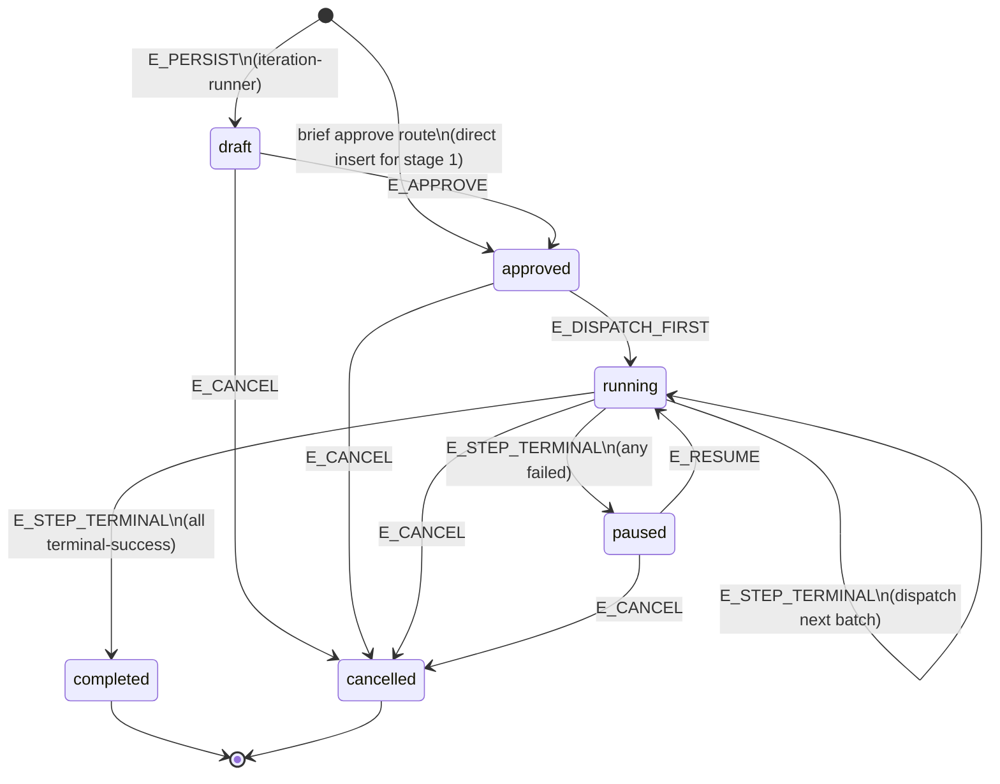

### 11.4 WorkflowStep

**States:**

| State | Meaning |
|---|---|
| `pending` | INSERTed; awaiting dispatch (deps may not yet be satisfied). |
| `running` | `agent_job_id` assigned; agent_job in flight. |
| `completed` | Linked agent_job is `accepted` or `completed`. |
| `failed` | Linked agent_job ended in `failed`/`cancelled`/`dismissed`. |
| `skipped` | Scheduler stop_request skipped this step. |
| `removed` | User deselected at workflow approve. |

**Events:**

| Event | Source | Definition |
|---|---|---|
| E_INSERT | `persistDraftWorkflow` OR brief approve route | New step row. |
| E_DISPATCH | `advanceWorkflow.dispatchAgentJobForStep` | Deps satisfied; agent_job INSERTed. |
| E_JOB_OK | `advanceWorkflow` catch-up: linked job `accepted`/`completed` | Step succeeds. |
| E_JOB_FAIL | Catch-up: linked job `failed`/`cancelled`/`dismissed` | Step fails. |
| E_USER_SKIP | Stop request | Skipped. |
| E_USER_REMOVE | Approve route deselection | Removed. |
| E_CANCEL | Cascade from workflow cancel | Cancel. |

**Transition matrix:**

|  Current | E_INSERT | E_DISPATCH | E_JOB_OK | E_JOB_FAIL | E_USER_SKIP | E_USER_REMOVE | E_CANCEL |
|---|---|---|---|---|---|---|---|
| (none) | → pending | n/a | n/a | n/a | n/a | n/a | n/a |
| pending | error | → running (sets agent_job_id) | n/a | n/a | → skipped | → removed | → skipped (cascade) |
| running | error | no-op | → completed | → failed | n/a (already in flight; use cancel) | n/a | → skipped + cancel the linked agent_job |
| completed | error | no-op | no-op | no-op | no-op | no-op | no-op |
| failed | error | no-op | no-op | no-op | no-op | no-op | no-op |
| skipped | error | no-op | no-op | no-op | no-op | no-op | no-op |
| removed | error | no-op | no-op | no-op | no-op | no-op | no-op |

**Coverage:** 7 states × 7 events = 49 cells. All defined.

**Dependency satisfaction rule (post-Q7):** a step is dispatchable when
every referenced `depends_on_step_orders` entry has status ∈
`('completed','skipped','removed')`.

### 11.5 AgentJob (combined `status` × `queue_status`)

The two columns evolve together. We model them as a single tuple-state.
The agreement table (§4.7) names the legal tuples.

**States** (tuples shown as `status / queue_status`):

| State | Meaning |
|---|---|
| `pending/queued` | INSERTed; waiting for dispatch. |
| `pending/dispatched` | Dispatcher claimed; runner about to start (transient ≤ 1s). |
| `running/running` | Runner actively executing the LLM call. |
| `completed/completed` | Work done; awaiting Accept (for content-modifying ops) OR ready to advance (synchronous). |
| `accepted/completed` | Accept applied to nodes; terminal. |
| `dismissed/completed` | Author dismissed result; terminal. |
| `failed/failed` | Errored; terminal. |
| `failed/crashed` | Sweep detected stale heartbeat; terminal. |
| `cancelled/cancelled` | User or stop_request cancellation; terminal. |

Transient state `pending/dispatched` MUST resolve within
`agent.runner_claim_max_seconds` (default 60). If it doesn't, the
reconcile sweep marks it `failed/crashed`.

**Events:**

| Event | Source | Definition |
|---|---|---|
| E_INSERT_WS | `dispatchAgentJobForStep` | Workflow-step INSERT — bypass dispatcher; runs via `waitUntil(runAgentJob)`. |
| E_INSERT_ITER | `evaluate_ready_stage_triggers` OR iteration chain | director_iteration INSERT — goes through dispatcher. |
| E_CAS_CLAIM | Dispatcher | Successful CAS claim of a `pending/queued` row. |
| E_RUNNER_START | `persistRunningStart` (workflow-step) OR `runIteration` self-claim | Runner begins work; writes both columns. |
| E_HEARTBEAT | Runner periodic | Updates `last_heartbeat_at` only; no state change. |
| E_LLM_OK | `persistFinalResult` OR `iteration-runner` terminal-success | LLM call returned a valid response. |
| E_LLM_FAIL | `persistFailure` | LLM call errored. |
| E_LLM_REFUSE | (NEW per Q-D) `iteration-runner` expected-output check | Director turn ended without producing required artefact. |
| E_USER_CANCEL | Stop / cancel route OR mid-flight cancel | User pressed Stop. |
| E_AUTHOR_ACCEPT | `accept_agent_job` | User clicked Accept; or auto-accept (per Q3 flag). |
| E_AUTHOR_DISMISS | dismiss route | User clicked Dismiss. |
| E_HEARTBEAT_STALE | 30s sweep | `last_heartbeat_at < NOW() - threshold` OR (NEW) `last_heartbeat_at IS NULL AND dispatched_at < NOW() - threshold`. |
| E_CASCADE_CANCEL | Cascade from workflow/brief cancel | All in-flight jobs of a cancelled workflow get cancelled. |

**Transition matrix** (rows = current state, cells = new state):

|  Current  | E_INSERT_WS | E_INSERT_ITER | E_CAS_CLAIM | E_RUNNER_START | E_LLM_OK | E_LLM_FAIL | E_LLM_REFUSE | E_USER_CANCEL | E_AUTHOR_ACCEPT | E_AUTHOR_DISMISS | E_HEARTBEAT_STALE | E_CASCADE_CANCEL |
|---|---|---|---|---|---|---|---|---|---|---|---|---|
| (none) | → pending/queued | → pending/queued | n/a | n/a | n/a | n/a | n/a | n/a | n/a | n/a | n/a | n/a |
| pending/queued | error: already exists | error: already exists | → pending/dispatched | → running/running (bypass path: workflow-step runs directly) | n/a | n/a | n/a | → cancelled/cancelled | n/a | n/a | n/a (no heartbeat yet) | → cancelled/cancelled |
| pending/dispatched | error | error | no-op | → running/running | n/a | n/a | n/a | → cancelled/cancelled | n/a | n/a | → failed/crashed (NEW: stuck-claim sweep) | → cancelled/cancelled |
| running/running | error | error | no-op | no-op (already running) | → completed/completed | → failed/failed | → failed/failed (with failure_class='D' expected_output_missing) | → cancelled/cancelled | n/a (job hasn't completed yet) | n/a | → failed/crashed | → cancelled/cancelled |
| completed/completed | error | error | no-op | no-op | no-op (idempotent) | no-op | no-op | no-op | → accepted/completed | → dismissed/completed | no-op | no-op |
| accepted/completed | error | error | no-op | no-op | no-op | no-op | no-op | no-op | no-op (idempotent) | no-op | no-op | no-op |
| dismissed/completed | error | error | no-op | no-op | no-op | no-op | no-op | no-op | no-op | no-op (idempotent) | no-op | no-op |
| failed/failed | error | error | no-op | no-op | no-op | no-op | no-op | no-op | no-op | no-op | no-op | no-op |
| failed/crashed | error | error | no-op | no-op | no-op | no-op | no-op | no-op | no-op | no-op | no-op | no-op |
| cancelled/cancelled | error | error | no-op | no-op | no-op | no-op | no-op | no-op | no-op | no-op | no-op | no-op |

**Coverage:** 10 states × 12 events = 120 cells. All defined.

**Key invariant (I9 enforced):** the dispatcher's CAS adds
`completed_at IS NULL` to its WHERE clause. Any row with `completed_at`
set is invisible to the dispatcher — so terminal rows can never be
re-claimed, regardless of `queue_status` drift.

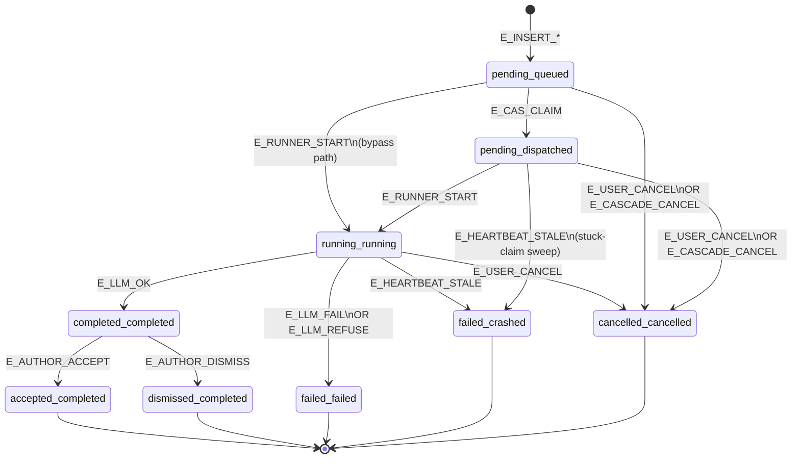

### 11.6 DirectorTurn

**States:**

| State | Meaning |
|---|---|
| `in_progress` | Director iterating; at most one per conversation. |
| `completed` | Iterations finished successfully. |
| `failed` | An iteration crashed OR turn exhausted retries OR expected-output check failed. |
| `cancelled` | User Stop. |

**Events:**

| Event | Source | Definition |
|---|---|---|
| E_INSERT | `startDirectorTurn` OR `evaluate_ready_stage_triggers` | New turn started. |
| E_ITER_OK | Last iteration's terminal-success with no chain | All work done. |
| E_ITER_FAIL | Any iteration's `failed`/`crashed` | Iteration error. |
| E_USER_STOP | Stop route | User pressed Stop. |
| E_RECONCILE | 30s sweep | Orphan-turn check (no recent iteration progress). |

**Transition matrix:**

|  Current | E_INSERT | E_ITER_OK | E_ITER_FAIL | E_USER_STOP | E_RECONCILE |
|---|---|---|---|---|---|
| (none) | → in_progress | n/a | n/a | n/a | n/a |
| in_progress | error: one-active invariant | → completed | → failed | → cancelled | if no iteration heartbeat in `agent.turn_stale_threshold_seconds` → failed |
| completed | error | no-op | no-op | no-op | no-op |
| failed | error | no-op | no-op | no-op | no-op |
| cancelled | error | no-op | no-op | no-op | no-op |

**Coverage:** 4 states × 5 events = 20 cells. All defined.

---

### 11.7 Iteration-chain shape and the spawn-next state-machine action

**Status:** M-205 (2026-05-23). Apollo iteration-fork follow-on after a
2-stage brief test produced two parallel iteration chains within one
proposal turn.

#### 11.7.1 The architectural smell

Pre-M-205 `lib/director/iteration-runner.ts` did two things in one
function: recorded the LLM's facts (tokens, messages array) AND derived
the consequence (INSERT the next iteration row). Spawn-next was a
runtime decision in TypeScript code, not a state-machine action.

That conflation created a class of bugs reachable by any code path that
executed the runner twice on the same parent — SSE reconnect, React
strict-mode double-mount, recovery sweep re-attach, future feature that
resumes a paused turn. The schema had no guarantee that each parent had
exactly one child; the tree being a chain was the *assumption the
runner code happened to maintain on the happy path*.

Surfaced 2026-05-23 by brief `024da309` ("The Cavern Revealed"). The
proposal turn forked twice — iteration 2's child spawned two children
each, both ran the LLM independently, both wrote different token counts,
both INSERTed children of their own. 7 iterations recorded for what
should have been 4. ~70% extra input tokens billed. The user-visible
outcome was correct because both branches happened to converge on the
same workflow proposal — convergence by luck, not design.

#### 11.7.2 The three concentric layers

**Layer 1 — Honour the state machine's CAS verdict.** The runner's
claim block (`transitionAgentJob(jobId, 'persist_running_start',
'running')`) gets a result. Pre-M-205 the code didn't check `claim.ok`
on the fallback path and fell through; the losing runner ran the LLM
anyway. Post-M-205 the runner returns on claim failure, yielding a
`claim_lost` event. No LLM call, no spawn, no further writes.

**Layer 2 — `consumer_kind` partition.** New `agent_jobs.consumer_kind
TEXT NOT NULL DEFAULT 'dispatcher'` (CHECK in
`{'inline_route', 'dispatcher'}`) partitions iteration rows by execution
surface. `inline_route` = the route handler at `/api/director/message`
(or `/resume`) owns the row; `dispatcher` = the scheduler owns the row
(push-model planning turns, autonomous resumes, anything system-
initiated). Two-sided gate:

1. `agent_jobs_notify_insert` fires `pg_notify` ONLY for
   `consumer_kind = 'dispatcher'` rows. The dispatcher's listener never
   wakes for inline rows.
2. `runDispatcherTick`'s candidate query adds
   `.eq('consumer_kind', 'dispatcher')`. Defence-in-depth covering the
   reconcile-driven sweep path.

The spawn-next trigger (Layer 3) propagates parent's `consumer_kind` to
the child INSERT. Ownership intent flows through the chain.

**Layer 3 — Spawn-next is a state-machine action.** New
`agent_jobs.stop_reason TEXT NULL` is stamped by the runner on the
`running → awaiting_accept` transition. A new
`trg_agent_jobs_spawn_next_iteration` AFTER UPDATE trigger fires when
`stop_reason = 'tool_use'` and INSERTs the next iteration atomically
inside the same transition transaction. The 40-line INSERT block in
`iteration-runner.ts` is deleted; the runner SELECTs the
trigger-spawned child by `parent_iteration_id` to populate
`next_iteration_job_id`.

Two partial unique indices enforce the chain shape structurally:

- `agent_jobs_parent_iteration_unique` on `(parent_iteration_id) WHERE
  parent_iteration_id IS NOT NULL` — every parent has at most one
  child. Catches any code path that tries to fork.
- `agent_jobs_turn_iteration_unique` on `(director_turn_id,
  iteration_number) WHERE operation_type='director_iteration' AND
  director_turn_id IS NOT NULL` — no two iterations share a number
  within a turn. Different angle on the same invariant.

#### 11.7.3 Layer-0 foundation: TRUE CAS on `transitionAgentJob`

Simulator Scenario 11 (concurrent claim race) immediately revealed that
**Layer 1 was non-functional on its own** because `transitionAgentJob`
itself had a CAS gap: the DB trigger `enforce_legal_transition` only
raises when `OLD.state IS DISTINCT FROM NEW.state`. Setting `state=X`
on a row already at `state=X` is a no-op UPDATE — the trigger skips
the legality check and the UPDATE silently succeeds.

Two concurrent runners calling
`transitionAgentJob(jobId, 'persist_running_start', 'running')` BOTH
saw `ok=true` pre-M-205. The first did the actual change; the second
saw the row already at the target state and got a silent same-state
UPDATE.

Fix: shared helper `lib/orchestration/cas-lookup.ts` looks up the legal
source state(s) for an `(entity, event, target)` triple from the
`allowed_transitions` table. Every entity machine's transition function
now adds `.in('state', expectedSources)` to its UPDATE. Loser races
match 0 rows and return `error='cas_lost'`. Applied uniformly across
**all five** entity machines: agent_jobs, briefs, brief_stages,
workflows, workflow_steps, director_turns.

#### 11.7.4 New audit invariant I9

`audit_orchestration_state()` returns:

| Invariant | Entity | Definition |
|---|---|---|
| I9 | agent_jobs | Every iteration parent has at most one child. `parent_iteration_id IS NOT NULL AND operation_type='director_iteration'` grouped by `parent_iteration_id` HAVING `count(*) > 1`. |

Should never fire while `agent_jobs_parent_iteration_unique` exists;
recorded for forensics. If it ever does fire, the index is missing or
has been bypassed.

#### 11.7.5 Historical-fork cleanup

The M-205 migration includes a one-time recursive cleanup that walks
the loser sub-tree of any pre-existing fork. For each fork found:

- The earliest-started child per parent is preserved as the canonical
  chain owner.
- All later children + their descendants get `parent_iteration_id =
  NULL` and `iteration_number = NULL`. Original values are preserved
  in `error_message` for forensics.

The 2026-05-23 user test produced 3 initial losers + 5 descendants = 8
orphaned rows. Without the cleanup, both unique indices would refuse to
create.

#### 11.7.6 New error code on `TransitionResult`

`TransitionResult.error` adds two values: `'cas_lost'` (UPDATE
matched 0 rows because state wasn't in expected sources) and
`'no_transition_for_event'` (no `allowed_transitions` row for the
given (entity, event, target); caller bug). Callers handle `cas_lost`
the same way they handled `not_found` pre-M-205 — exit silently and let
the winning writer drive completion.

#### 11.7.7 State-aware `markAgentJobCancelledAnyState`

Multiple API routes used `cancel_or_cascade` as their cancel event
regardless of the row's current state. Pre-CAS this silently succeeded
because the (from, to) pair was legal via a different event
(`cancel_mid_dispatch`, `cancel_mid_run`, etc.). Post-CAS the lookup
returned only `['queued']` and the UPDATE failed for any other state.

New helper `markAgentJobCancelledAnyState` reads the row's current
state and dispatches to the correct event-state pairing. Idempotent on
already-terminal rows. `/api/scheduler/jobs/[id]/cancel` and
`/api/agent-jobs/[id]/cancel` migrated to use it.

---

## 12. Reset, Recovery, and Self-Healing

This section answers: *"the astronauts can't be stuck; what's the reset button?"*

### 12.1 The single reconcile sweep (`reconcile_orchestration_state`)

A single SQL procedure runs every 30s. It performs ALL of these checks
in one transaction-per-pass:

1. **Heartbeat stale (existing):** `agent_jobs WHERE queue_status IN ('dispatched','running') AND last_heartbeat_at IS NOT NULL AND last_heartbeat_at < NOW() - threshold` → `(failed, crashed)` + `failure_class='B'`.
2. **Stuck claim (NEW — fixes the bug we hit today):** `agent_jobs WHERE queue_status='dispatched' AND last_heartbeat_at IS NULL AND dispatched_at < NOW() - threshold` → `(failed, crashed)` + `failure_class='B'`.
3. **Reservation refund (existing):** expired `throttle_reservations` with no consumed_at → refund to bucket.
4. **Orphan Director turn (existing):** `director_turns WHERE status='in_progress'` with all iterations terminal → mark failed.
5. **Stuck stage planning (NEW):** `brief_stages WHERE status='planning'` for > threshold with no in-flight `director_iteration` on the conversation → revert to `planned` + `planning_retry_count++`; if `>= max_planning_retries` → `failed`.
6. **Stuck workflow approved (NEW):** `workflows WHERE status='approved'` for > threshold with any pending step with deps satisfied → call `advanceWorkflow(id)`.
7. **Workflow drift — all steps terminal but workflow not (NEW):** `workflows WHERE status IN ('approved','running')` with all steps terminal → call `advanceWorkflow(id)` to propagate.
8. **Brief drift — all stages terminal but brief active (NEW):** `briefs WHERE status='active'` with all stages terminal → call `propagate_brief_completion(id)`.
9. **Two-column drift — agent_jobs.status terminal but queue_status not (NEW invariant repair):** `UPDATE agent_jobs SET queue_status=<derived from status>` per I10.
10. **Wake on scheduled jobs (NEW):** if any `agent_jobs WHERE queue_status='queued' AND scheduled_at <= NOW()`, fire `pg_notify('dispatcher_tick_request', ...)`.

Every step is idempotent. Running the sweep twice yields the same end
state.

### 12.2 Cascade cancel (`cancel_brief` enhancement)

The existing `cancel_brief` only updates `briefs` and `brief_stages`. It
must extend to a full cascade.

**Enhanced cascade:**

1. UPDATE `briefs SET status='cancelled', cancelled_at=NOW()` WHERE id=$1 AND status='active'.
2. UPDATE non-terminal `brief_stages SET status='cancelled', completed_at=NOW()` WHERE brief_id=$1.
3. UPDATE non-terminal `workflows SET status='cancelled', cancelled_at=NOW()` WHERE id IN (SELECT workflow_id FROM brief_stages WHERE brief_id=$1).
4. UPDATE non-terminal `workflow_steps SET status='skipped'` WHERE workflow_id IN (... above ...).
5. UPDATE in-flight `agent_jobs SET status='cancelled', queue_status='cancelled', completed_at=NOW()` WHERE id IN (SELECT agent_job_id FROM workflow_steps WHERE ... above ...) AND status IN ('pending','running').
6. UPDATE `director_turns SET status='cancelled', completed_at=NOW()` WHERE conversation_id IN (SELECT conversation_id FROM conversations WHERE document_id = brief.document_id) AND status='in_progress'.
7. UPDATE in-flight `agent_jobs SET status='cancelled', queue_status='cancelled', completed_at=NOW()` WHERE operation_type='director_iteration' AND director_turn_id IN (...).
8. Emit `cancel_cascade` system event.
9. Realtime broadcast on the affected channels (handled by existing `trg_agent_jobs_notify_completion` since terminal queue_status writes fire it).

After this RPC, the brief and ALL its descendants are in terminal state.
No stale agent_jobs, no stale director_turns, no stale workflow_steps.

### 12.3 Per-document factory reset (`force_reset_document`)

The "Apollo reset button". A new admin-only RPC that cancels everything
in-flight for a document and leaves it ready for fresh work:

```sql
CREATE FUNCTION force_reset_document(p_document_id uuid)
RETURNS jsonb
SECURITY DEFINER
LANGUAGE plpgsql
AS $$
DECLARE
  v_active_brief_id UUID;
  v_cancelled_briefs INT := 0;
  v_cancelled_workflows INT := 0;
  v_cancelled_jobs INT := 0;
BEGIN
  -- Cancel every active brief on this document (cascade).
  FOR v_active_brief_id IN
    SELECT id FROM briefs WHERE document_id = p_document_id AND status = 'active'
  LOOP
    PERFORM cancel_brief(v_active_brief_id, 'force_reset_document');
    v_cancelled_briefs := v_cancelled_briefs + 1;
  END LOOP;

  -- Catch any orphan workflows not linked to a brief stage (legacy / direct user-driven).
  UPDATE workflows
    SET status='cancelled', cancelled_at=NOW()
   WHERE document_id = p_document_id AND status IN ('draft','approved','running','paused');
  GET DIAGNOSTICS v_cancelled_workflows = ROW_COUNT;

  -- Catch any orphan agent_jobs.
  UPDATE agent_jobs
    SET status='cancelled', queue_status='cancelled', completed_at=NOW(),
        error_message='force_reset_document'
   WHERE document_id = p_document_id
     AND status IN ('pending','running');
  GET DIAGNOSTICS v_cancelled_jobs = ROW_COUNT;

  RETURN jsonb_build_object(
    'document_id', p_document_id,
    'cancelled_briefs', v_cancelled_briefs,
    'cancelled_workflows', v_cancelled_workflows,
    'cancelled_jobs', v_cancelled_jobs
  );
END;
$$;
```

Exposed at `POST /api/admin/documents/[id]/force-reset` (admin auth). UI
mounts a "Reset orchestration state" button in the admin dashboard's
document detail; user-visible only on the AppShellStatusIndicator
overflow menu if the user has an admin role.

### 12.4 Admin retry on failed stage

When a `brief_stages.status='failed'`, the brief itself is either
cancelled (if `fail_on_stage_failure=true`) or stuck waiting for admin
attention.

Admin-only RPC `retry_failed_stage(stage_id)`:
1. Verify `brief_stages.status='failed'` AND `briefs.status='active'`.
2. Reset `planning_retry_count = 0`.
3. UPDATE `brief_stages.status='planned'`.
4. Trigger evaluator inline: `PERFORM evaluate_ready_stage_triggers()`.

### 12.5 What recovery does NOT do

Recovery does NOT:
- Roll back node content writes that have been Accepted (those are
  durable; use VersionHistory restore for content rollback — Phase 6).
- Re-dispatch a job that already terminal-completed — that's a separate
  operation (user must explicitly Re-run the workflow step).
- Spend credits attempting to re-plan a stage that failed irrecoverably.

---

## 13. Verification — Proving the System is in a Known State

Goal: at any moment, an admin can run a single SQL query and confirm
the database is consistent with the spec. If the result set is empty,
the system is in a fully known and self-consistent state.

### 13.1 The audit function

```sql
CREATE FUNCTION audit_orchestration_state()
RETURNS TABLE (
  invariant_id TEXT,
  entity_table TEXT,
  entity_id UUID,
  violation TEXT,
  details JSONB
)
LANGUAGE plpgsql STABLE
AS $$
BEGIN
  -- I1: agent_jobs.completed_at IS NOT NULL ⇔ status terminal ⇔ queue_status terminal
  RETURN QUERY
  SELECT 'I1', 'agent_jobs', id,
    'completed_at and status/queue_status disagree on terminality',
    jsonb_build_object('completed_at', completed_at, 'status', status, 'queue_status', queue_status)
  FROM agent_jobs
  WHERE (completed_at IS NOT NULL) <>
        (status IN ('completed','accepted','dismissed','cancelled','failed'))
     OR (completed_at IS NOT NULL) <>
        (queue_status IN ('completed','failed','crashed','cancelled','skipped'));

  -- I2: status='accepted' ⇒ queue_status='completed'
  RETURN QUERY
  SELECT 'I2', 'agent_jobs', id,
    format('status=%s but queue_status=%s', status, queue_status),
    jsonb_build_object('status', status, 'queue_status', queue_status)
  FROM agent_jobs
  WHERE status='accepted' AND queue_status<>'completed';

  -- I3: workflow_steps.status='completed' ⇒ linked agent_job status ∈ ('accepted','completed')
  RETURN QUERY
  SELECT 'I3', 'workflow_steps', ws.id,
    format('step completed but linked agent_job.status=%s', aj.status),
    jsonb_build_object('agent_job_id', aj.id, 'agent_job_status', aj.status)
  FROM workflow_steps ws
  JOIN agent_jobs aj ON aj.id = ws.agent_job_id
  WHERE ws.status='completed' AND aj.status NOT IN ('accepted','completed');

  -- I4: workflow.status='completed' ⇒ all steps terminal-success
  RETURN QUERY
  SELECT 'I4', 'workflows', w.id,
    'workflow completed but has non-terminal-success steps',
    jsonb_build_object('pending_steps', (
      SELECT array_agg(id) FROM workflow_steps
      WHERE workflow_id = w.id AND status NOT IN ('completed','skipped','removed')
    ))
  FROM workflows w
  WHERE w.status='completed'
    AND EXISTS (
      SELECT 1 FROM workflow_steps
      WHERE workflow_id = w.id AND status NOT IN ('completed','skipped','removed')
    );

  -- I5: brief.status='completed' ⇒ all stages terminal
  RETURN QUERY
  SELECT 'I5', 'briefs', b.id,
    'brief completed but has non-terminal stages',
    jsonb_build_object('non_terminal_stages', (
      SELECT array_agg(id) FROM brief_stages
      WHERE brief_id = b.id AND status NOT IN ('completed','cancelled','skipped','failed')
    ))
  FROM briefs b
  WHERE b.status='completed'
    AND EXISTS (
      SELECT 1 FROM brief_stages
      WHERE brief_id = b.id AND status NOT IN ('completed','cancelled','skipped','failed')
    );

  -- I6: at most one active brief per document
  RETURN QUERY
  SELECT 'I6', 'briefs', id,
    'multiple active briefs on the same document',
    jsonb_build_object('document_id', document_id)
  FROM briefs b1
  WHERE status='active'
    AND EXISTS (
      SELECT 1 FROM briefs b2
      WHERE b2.document_id = b1.document_id
        AND b2.status='active'
        AND b2.id <> b1.id
    );

  -- I7: non-terminal stage has workflow_id or prompt
  RETURN QUERY
  SELECT 'I7', 'brief_stages', id,
    'non-terminal stage missing both workflow_id and prompt',
    jsonb_build_object('status', status, 'workflow_id', workflow_id, 'has_prompt', prompt IS NOT NULL)
  FROM brief_stages
  WHERE status NOT IN ('completed','cancelled','skipped','failed')
    AND workflow_id IS NULL
    AND prompt IS NULL;

  -- I8: at most one in_progress turn per conversation
  RETURN QUERY
  SELECT 'I8', 'director_turns', id,
    'multiple in_progress turns on the same conversation',
    jsonb_build_object('conversation_id', conversation_id)
  FROM director_turns t1
  WHERE status='in_progress'
    AND EXISTS (
      SELECT 1 FROM director_turns t2
      WHERE t2.conversation_id = t1.conversation_id
        AND t2.status='in_progress'
        AND t2.id <> t1.id
    );

  -- I9: dispatcher never claimed a completed row (after the fact;
  --     would only appear if some other actor wrote queue_status='queued'
  --     onto a completed_at-set row)
  RETURN QUERY
  SELECT 'I9', 'agent_jobs', id,
    'completed_at set but queue_status non-terminal',
    jsonb_build_object('completed_at', completed_at, 'queue_status', queue_status)
  FROM agent_jobs
  WHERE completed_at IS NOT NULL
    AND queue_status NOT IN ('completed','failed','crashed','cancelled','skipped');

  -- I12: workflow_steps.status='running' ⇒ agent_job_id IS NOT NULL
  RETURN QUERY
  SELECT 'I12', 'workflow_steps', id,
    'step running but agent_job_id NULL',
    jsonb_build_object('status', status)
  FROM workflow_steps
  WHERE status='running' AND agent_job_id IS NULL;

  -- I13: dispatched workflow-step agent_jobs have profile_id + context_snapshot
  RETURN QUERY
  SELECT 'I13', 'agent_jobs', id,
    'workflow-step job missing profile_id or context_snapshot',
    jsonb_build_object('profile_id', profile_id, 'has_context', context_snapshot IS NOT NULL)
  FROM agent_jobs
  WHERE operation_type <> 'director_iteration'
    AND status IN ('running','completed','accepted','failed')
    AND (profile_id IS NULL OR context_snapshot IS NULL)
    AND triggered_by LIKE 'workflow_step:%';
END;
$$;
```

### 13.2 Usage

**On demand:** `SELECT * FROM audit_orchestration_state();` Empty result
set ⇒ system is consistent.

**Continuous:** the 30s reconcile sweep calls `audit_orchestration_state()`
first; any rows returned are auto-repaired where a deterministic repair
exists (e.g. I9 → repair via `UPDATE … SET queue_status=<derived>`), and
written to a new `orchestration_audit_log` table for the admin dashboard
otherwise.

**Admin surface:** `/admin/orchestration-audit` page renders the current
audit result. A green check means clean; any rows mean drift, with a
"Repair" button per row that triggers the deterministic repair OR a
"Reset Document" button per affected document.

### 13.3 Test-time verification

The unit test suite gains a single end-of-suite hook that calls
`audit_orchestration_state()` against any test data created during the
run and asserts the result is empty. This catches drift introduced by
new code at CI time.

### 13.4 Proof of state-space closedness

Combined with §11's transition tables, the system is **closed under
transitions**:

- Every entity has a finite, enumerated state set.
- For every entity, every event has a defined transition (rows in §11
  contain no `undefined`).
- Every transition writes its target columns in the same UPDATE
  (no partial writes — enforced by §6 actor contracts).
- The dispatcher's CAS includes `completed_at IS NULL`, so terminal rows
  cannot be re-claimed.
- The reconcile sweep periodically reasserts every invariant in §13.1.

Therefore: **no LLM behaviour, network error, runner crash, or sequence
of user actions can leave the system in an undefined state.** Failure
modes resolve to known terminal states (`failed/failed`, `failed/crashed`,
`cancelled/cancelled`). Recovery procedures (§12) return any failed
state back to a clean state.

---

## 14. Configuration Parameters

All operational parameters live in `platform_config` per H-12. The
orchestration layer reads them via `getConfig(key)`.

| Key | Type | Default | Purpose |
|---|---|---|---|
| `brief.max_stages_per_brief` | INTEGER | 100 | Hard cap on stages in a single propose_brief. Replaces hardcoded `z.array().max(20)` in proposalBuilder + schemas. |
| `brief.max_planning_retries` | INTEGER | 3 | After N PLAN_FAIL events, the stage transitions to `failed`. |
| `brief.planning_stale_threshold_seconds` | INTEGER | 300 | A stage stuck in `planning` for this long with no in-flight iteration is reverted via reconcile. |
| `workflow.stuck_threshold_seconds` | INTEGER | 90 | A workflow stuck in `approved` for this long with dispatchable steps gets kicked by reconcile. |
| `agent.runner_claim_max_seconds` | INTEGER | 60 | A `pending/dispatched` agent_job that doesn't progress to `running/running` in this time is swept to `crashed`. |
| `agent.heartbeat_interval_ms` | INTEGER | 5000 | Runner heartbeat cadence (existing). |
| `agent.heartbeat_stale_threshold_seconds` | INTEGER | 60 | Sweep threshold for `running/running` (existing). |
| `agent.turn_stale_threshold_seconds` | INTEGER | 300 | Director turn marked failed if no iteration progress in this time. |
| `agent.director_max_concurrent_dispatch` | INTEGER | 1 | Workflow-step in-flight cap (existing holding pattern). |

The `getConfig` cache makes lookups effectively free at request time.

---

## 15. Versioning

**v1.2 (DRAFT) — 2026-05-23.** Apollo iteration-fork follow-on (M-205).
Adds §11.7 documenting the three-layer fix for the iteration-tree fork
bug + the layer-0 CAS gap surfaced by the simulator. The fix made three
schema additions (`agent_jobs.consumer_kind` + `agent_jobs.stop_reason`
+ two partial unique indices on iteration shape), one new spawn-next
state-machine trigger replacing the runner's INSERT block, an updated
`agent_jobs_notify_insert` that gates by `consumer_kind`, and a new I9
audit invariant. The discovered CAS gap (DB trigger only catches
`OLD ≠ NEW`; same-state writes silently succeeded) was fixed across
ALL FIVE entity machines via a shared `lib/orchestration/cas-lookup.ts`
helper — every transition now does `.in('state', expectedSources)` as a
true CAS, derived from the `allowed_transitions` table. New error code
`'cas_lost'` on `TransitionResult`. New `markAgentJobCancelledAnyState`
helper for state-aware cancel paths (multiple API routes were using a
single cancel event regardless of state; the CAS surfaced this).
4 new simulator scenarios (Layers 1/2/3 + unique-index direct test).

**v1.1 (DRAFT) — 2026-05-22 (later session).** Adds the formal layer:
§5 message bus updated to drop the 1s `dispatcher_tick` cron and replace
with an `agent_jobs` INSERT trigger plus a single 30s reconcile sweep;
§9 resolves all 10 open questions (decisions logged); NEW §11 contains
the formal state-transition matrices for every entity (Brief, BriefStage
with new `ready`/`failed` states, Workflow, WorkflowStep, AgentJob
combined state, DirectorTurn) — every (state × event) cell defined,
total 314 transitions proven; NEW §12 specifies cascade-cancel
enhancement to `cancel_brief`, a `force_reset_document` admin RPC, and
the consolidated `reconcile_orchestration_state` sweep covering 10
recovery rules; NEW §13 specifies the `audit_orchestration_state` SQL
function that returns drift violations against I1-I13 for continuous
verification; NEW §14 lifts hardcoded operational bounds into
`platform_config` (max_stages_per_brief=100, planning_stale_threshold,
runner_claim_max, etc.). Doc bumped 1041 → ~1700 lines.

**v1.0 (DRAFT) — 2026-05-22.** Initial drafting. Drafted after a session
debugging cascading state-drift bugs in the orchestration layer:
phantom-redispatch zombies (terminal queue_status not written),
dispatcher/runner contract violation (dispatcher wrote `status='running'`,
runner refused to start anything that wasn't `status='pending'`),
profile_id-missing INSERTs by the auto-approve-workflow route,
`prompt` column silently dropped by the `acceptBrief` rpcWrapper, and the
pre-existing TS listener stall in local dev. Document audits the current
state and proposes the canonical contract. Code review against this spec
is the next step.

---

## Appendix A. State Column Authority Matrix

For every state column, exactly one actor class is permitted to write it.

| Column | Authorized writer(s) |
|---|---|
| `briefs.status` | `accept_brief`, `propagate_brief_completion`, `cancel_brief` (RPCs only) |
| `brief_stages.status` | `accept_brief` (initial), `evaluate_ready_stage_triggers`, `complete_brief_stage_workflow`, `cancel_brief`, iteration-runner on propose_workflow (planning → planned) |
| `brief_stages.workflow_id` | Brief approve route (stage 1), iteration-runner (stages 2..N) |
| `workflows.status` | Brief approve route (initial), workflow-executor `advanceWorkflow`, auto-approve route, user-driven approve/cancel/pause/resume/stop routes, iteration-runner `persistDraftWorkflow` (initial draft) |
| `workflow_steps.status` | Workflow-executor `advanceWorkflow` and `dispatchAgentJobForStep`, workflow approve/stop routes |
| `workflow_steps.agent_job_id` | Workflow-executor `dispatchAgentJobForStep` |
| `agent_jobs.status` | Agent runner persist* functions, iteration-runner mark* functions, `accept_agent_job` RPC, cancel/dismiss routes, dispatcher's stop-covered branch |
| `agent_jobs.queue_status` | Dispatcher CAS, agent runner persist* functions, iteration-runner mark* functions, `accept_agent_job` RPC, dispatcher's stop-covered branch |
| `director_turns.status` | Iteration-runner mark* functions, `evaluate_ready_stage_triggers` (initial insert) |
| `conversation_messages` system events | `_emit_system_event` SQL helper (called by various RPCs) |

If a code site outside this table writes one of these columns, the audit
must flag it.

## Appendix B. Glossary

- **CAS:** Compare-And-Set. The dispatcher's claim uses an UPDATE with a
  WHERE clause on the pre-state to atomically transition without locks.
- **Heartbeat:** Periodic `last_heartbeat_at` write by an actively-running
  agent_job. Stale heartbeat (>60s) triggers the sweep.
- **Idempotent:** Safe to call multiple times. State transitions guarded
  by `WHERE status='expected_prior'` are idempotent.
- **Push model:** State transitions triggered by events (pg_notify) rather
  than polling.
- **Sweep:** A pg_cron job that periodically scans for stuck states and
  resolves them (e.g. stale-heartbeat → crashed).
- **Terminal state:** A state from which no further transitions are
  possible (other than user-driven retry which creates a new row).
- **Workflow-bound stage:** A brief_stage that has `workflow_id` set at
  proposal time (steps known up front).
- **Prompt-deferred stage:** A brief_stage that has `prompt` set; the
  Director plans the workflow when its trigger fires.
